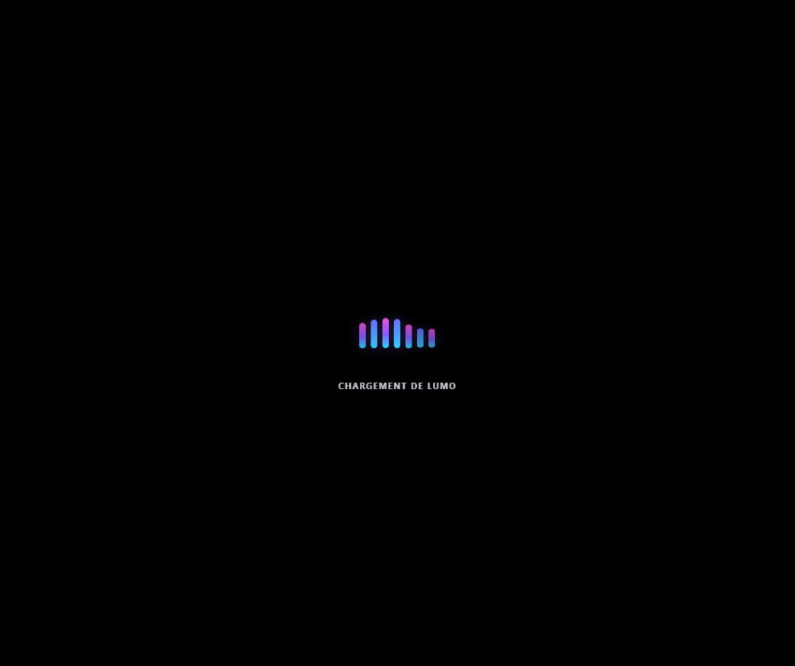
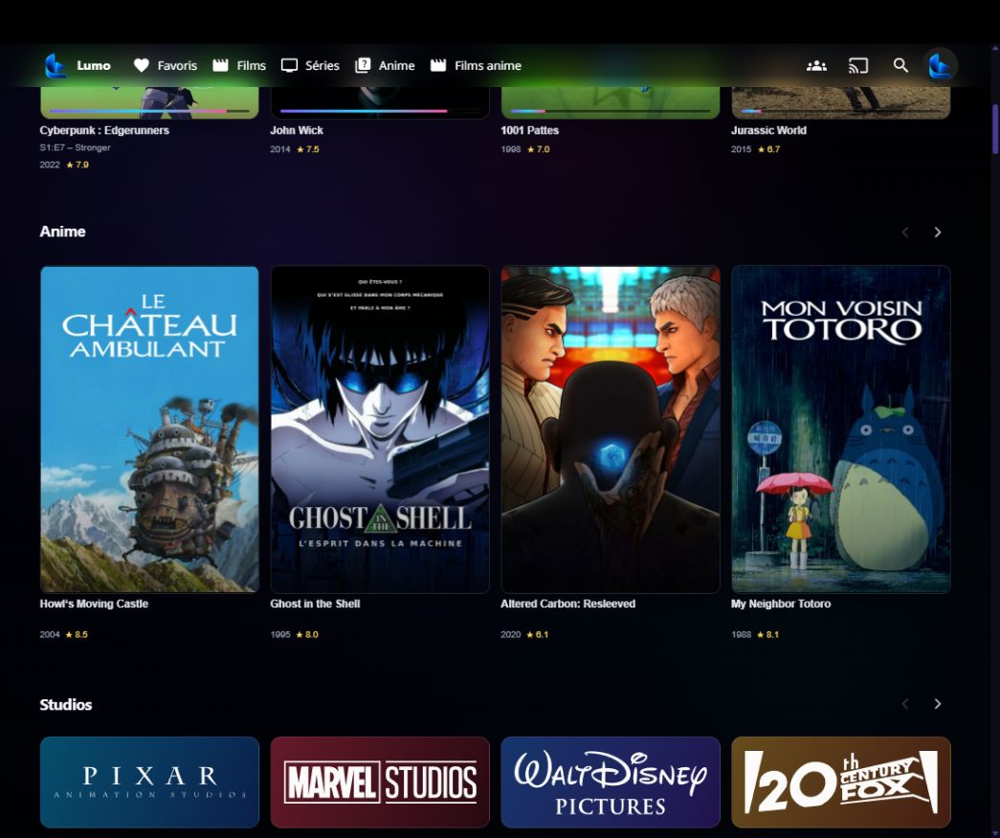
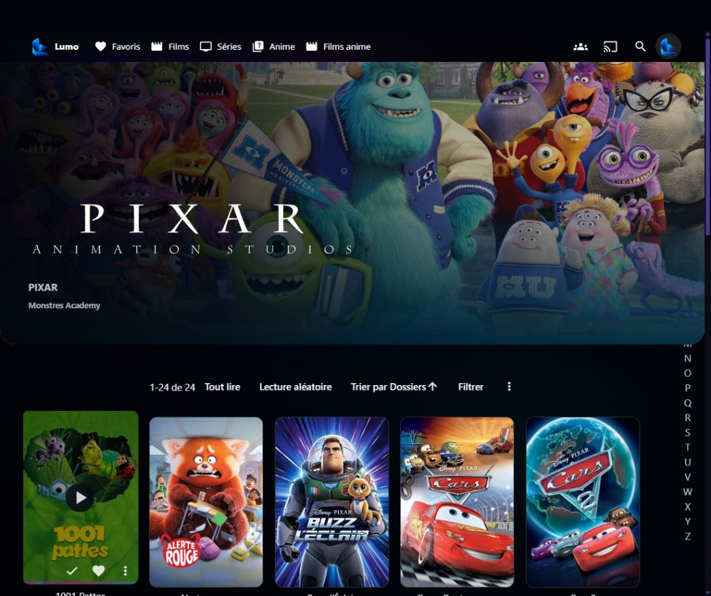
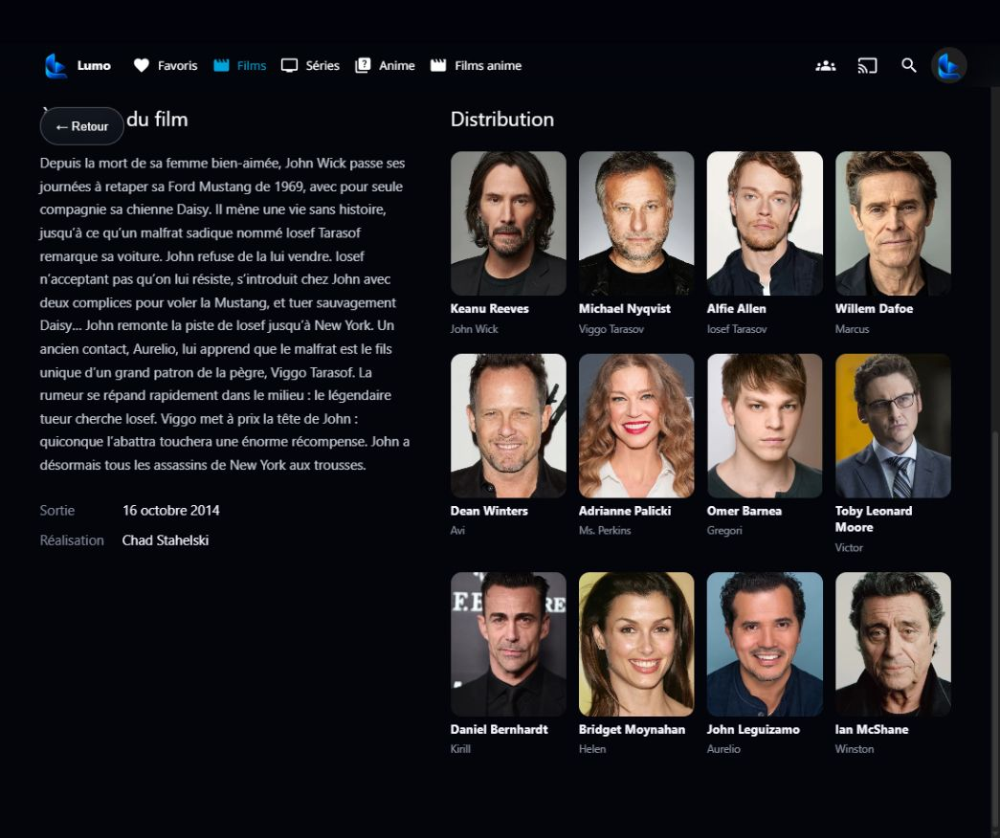

# Lumo pour Jellyfin 12

Thème cinématique + extension d'interface pour Jellyfin 12. L'installation complète injecte le CSS local et le runtime JavaScript directement dans `jellyfin-web`.

**État :** version 1.16.2 du thème et de l'installateur disponible sous forme de tag Git. Les vérifications du dépôt portent sur le JavaScript, la configuration et la mise en page ; l'installation sur une instance Jellyfin neuve n'a pas été validée dans cet audit.

[Télécharger le ZIP v1.16.2](https://github.com/0x80070006/Noctafin-jellyfin-theme-/archive/refs/tags/v1.16.2.zip) · [Télécharger le TAR.GZ v1.16.2](https://github.com/0x80070006/Noctafin-jellyfin-theme-/archive/refs/tags/v1.16.2.tar.gz) · [Historique des tags](https://github.com/0x80070006/Noctafin-jellyfin-theme-/tags)

Le dépôt ne publie pas encore de release GitHub avec un paquet d'installation distinct. Les liens ci-dessus téléchargent les sources figées au tag.

## Technologies et dépendances

CSS, JavaScript sans dépendances npm à installer, scripts d'installation Bash et PowerShell. Jellyfin 12 et l'accès au répertoire `jellyfin-web` sont nécessaires pour l'installation complète. Les scripts modifient les fichiers de l'interface web de Jellyfin : sauvegardez votre installation et consultez [la configuration](docs/CONFIGURATION.md) et [le dépannage](docs/TROUBLESHOOTING.md).

## Captures réelles

Ces captures proviennent de l'interface Jellyfin avec Lumo installé, depuis une bibliothèque active. Les affiches et titres dépendent de la bibliothèque connectée.










## Corrections 1.16.2

- Le Hero attend que son fond soit prêt pour changer simultanément image, titre, synopsis, boutons et sélection. Le fond suivant est préchargé pour garder une rotation fluide ; les chargements tardifs ne peuvent plus afficher une ancienne image sur un nouveau titre.
- Le fondu des fonds passe à 320 ms. Si une image échoue, un fond sombre de secours accompagne le titre sans bloquer le carrousel.

## Corrections 1.16.1

- Le chargement démarre avant les modules de Jellyfin : un voile noir Lumo couvre le logo de démarrage natif. Il dure au moins **5 secondes** puis disparaît en fondu une fois l'accueil prêt.
- Lors d'un changement d'onglet ou de catégorie, le voile couvre toute la fenêtre pendant au moins **3 secondes**. Il attend la vue et les visuels principaux jusqu'à une limite de 9 secondes ; en cas d'échec, l'interface reste accessible.
- Les titres du Hero, des fiches et des jaquettes Studio se fondent progressivement dans leur logo dès que celui-ci est chargé. Un logo indisponible laisse le titre lisible.
- L'installation est réversible : l'option **Désinstaller** retire le chargeur précoce, le CSS et le runtime ajoutés à Jellyfin Web.

## Nouveautés 1.16.0

- Fond nébuleuse interactif léger, dessiné localement sans dépendance externe. Il réagit doucement au pointeur, limite sa fréquence d'image et se met en pause lorsque l'onglet ou le lecteur est actif.
- Écran de démarrage et loaders liquides aux couleurs de Lumo pour les fiches et les lignes chargées à la demande.
- Cache de session borné pour les sélections et le Hero, avec expiration courte pour « Continuer de regarder » et cache quotidien pour les autres lignes.
- Ligne « Anime » créée automatiquement lorsqu'un genre Anime, Animé, Japanimation ou équivalent est présent dans la bibliothèque.
- Menu CLI au lancement des installateurs Linux et Windows : installer, désinstaller ou quitter. Les options `--install` et `--uninstall` restent disponibles pour l'automatisation.

## Corrections 1.15.2

- Les cartes de films et séries ouvrent leur fiche cinématique ; seul un bouton « Lecture » démarre la vidéo. Les cartes d'épisodes dans une fiche de série gardent leur action de lecture explicite.
- La fiche d'un film présente son fond, sa date de sortie, son synopsis, sa réalisation et sa distribution lorsqu'ils sont renseignés dans Jellyfin. Un bouton « Retour » est toujours visible.
- Le lecteur conserve les dimensions et la position des commandes définies par Jellyfin. Les anciennes règles CSS qui déplaçaient la vidéo et masquaient l'action de retour ont été retirées.

## Corrections 1.15.1

- Un seul Hero sur l'accueil : l'installateur retire l'ancien chargeur Spotlight d'Abyss lorsqu'il est présent.
- Pixar, DreamWorks Animation et Walt Disney Pictures ouvrent le studio exact trouvé par nom sur le serveur connecté. Aucun identifiant de studio ou de serveur n'est livré en dur.
- Les sept logos des studios, dont Marvel et DreamWorks, sont fournis dans le dépôt et restent cadrés dans leurs jaquettes.

## Nouveautés 1.15.0

- Fond normal noir avec reflets violets et cyan qui changent lentement de position. Les fonds saisonniers gardent leur image.
- Rail de sept jaquettes « Studios & plateformes » placé sous le Hero, avant « Continuer de regarder ». Logos embarqués pour fonctionner hors ligne ; les cartes ouvrent le filtre natif quand le serveur possède la métadonnée correspondante.
- Flèches accessibles sur le Hero, aperçu vidéo muet sur les cartes après un délai, avec priorité à la bande-annonce locale puis à une vidéo de thème fournie par Jellyfin.
- Ligne « Continuer de regarder » limitée à un épisode par série dans Lumo. L'identité de l'épisode est conservée pour reprendre au bon endroit.
- La sélection d'un compte Jellyfin ne réutilise plus le jeton d'un autre serveur sauvegardé dans le navigateur.

Voir [les fonctions et limites de Jellyfin 12](docs/INTEGRATIONS.md) avant l'installation.

## Base conservée de la v1.14

### Lecture : priorité au gestionnaire natif Jellyfin

Les boutons « Lecture » du Hero, des fiches Film et Série, de **Lecture en cours** et des cartes épisodes restent raccordés à un seul bus `itemId`. Les cartes des rails ouvrent une fiche sans lancer la lecture.

La v1.14 ne dépend plus d'un objet média JavaScript capturé lors du rendu. Au clic :

1. Lumo relit l'`itemId` sur le nœud réellement cliqué.
2. Une Série est d'abord résolue vers un épisode concret : reprise, sinon Next Up, sinon premier épisode.
3. Lumo crée une `itemAction` native temporaire avec l'ID, le serveur, le type, le média, l'action Play/Resume et la position de reprise.
4. Cette action est insérée dans un conteneur Jellyfin déjà géré par son système de shortcuts puis cliquée.
5. Si ce pont n'est pas disponible, Lumo essaie une action native exacte déjà rendue.
6. Ensuite seulement, `PlaybackManager.play()` est utilisé avec `ids:[resolvedId]`, `serverId` et `startPositionTicks`.
7. La fiche native exacte reste le dernier fallback. Aucun retour forcé vers l'accueil.

Un clic plus récent annule désormais proprement une tentative précédente. L'état `playback-pending` ne masque plus l'interface avant que le vrai lecteur existe.

### Rails et scroll

- 12 médias maximum par rail, 6 visibles sur desktop.
- Desktop : navigation horizontale par flèches ; le rail ne capture plus la molette verticale.
- Tactile : swipe horizontal natif conservé.
- Posters affichés entièrement avec `object-fit: contain`.
- Le zoom est limité à l'image **à l'intérieur** du cadre fixe : la carte ne sort plus de sa ligne.
- Même confinement pour les logos Studios/Réseaux.
- Ancien navigateur plein écran/scroll-lock retiré.
- MutationObserver et watchdog allégés pour réduire les remounts inutiles.

### Chaîne CSS 1.14

`styles/boot.css` et `scripts/noctafin-boot.js` démarrent en premier dans le `<head>`. Ensuite `theme.css` charge, dans cet ordre, `tokens`, `core`, `header`, `home`, `details`, `player`, `responsive`, puis les couches de compatibilité `lumo-v1.10.css` à `lumo-v1.16.css`, toutes cache-bustées en `?v=1.16.2`.

### Validation

`npm run check` contrôle la configuration, les six points d'entrée playback et les invariants de layout/scroll. Les installateurs Shell sont également vérifiés séparément.

## Configuration des saisons

Dans `scripts/noctafin-config.js` :

```js
seasonal: {
  enabled: true,
  forceSeason: "auto",
  halloweenMonth: 10,
  christmasMonth: 12
}
```

Pour tester manuellement : `forceSeason: "halloween"`, `"christmas"` ou `"default"`.

## Configuration des fiches séries

```js
details: {
  enabled: true,
  autoExpandFirstSeason: true,
  episodePageSize: 60
}
```

## Installation Linux / LXC

Depuis le dossier du dépôt :

```bash
chmod +x install/install.sh
JELLYFIN_WEB_DIR=/usr/share/jellyfin/web ./install/install.sh
systemctl restart jellyfin
```

Dans un terminal, le script affiche un menu **Installer / Désinstaller**. Pour un déploiement automatisé, utilise explicitement `--install` ou `--uninstall` ; sans terminal interactif, l'action par défaut reste l'installation. Sous Windows, `install.ps1` propose le même menu et accepte `-Action Install` ou `-Action Uninstall`.

Si le conteneur n'a pas accès à Wikimedia, `LUMO_DOWNLOAD_EXTRA_LOGOS=0`
évite d'attendre les logos optionnels. Les sept jaquettes fournies restent disponibles.

Recharge ensuite le navigateur avec `Ctrl+Shift+R`.

Pour l'installation complète, laisse le champ **CSS personnalisé** de Jellyfin vide. L'installateur ajoute automatiquement :

```html
<link rel="stylesheet" href="ui/lumo/styles/boot.css?v=1.16.2" data-lumo-boot-style="1.16.2">
<script src="ui/noctafin-boot.js?v=1.16.2" data-lumo-boot="1.16.2"></script>
<link rel="stylesheet" href="ui/lumo/theme.css?v=1.16.2" data-lumo-theme="1.16.2">
<script src="ui/noctafin-config.js?v=1.16.2" data-noctafin-config></script>
<script src="ui/noctafin-home.js?v=1.16.2" data-noctafin-home></script>
```

## Mise à jour

Extrais la nouvelle archive, puis relance l'installateur depuis son dossier :

```bash
cd /chemin/vers/Lumo-Jellyfin-v1.16.2
chmod +x install/install.sh
JELLYFIN_WEB_DIR=/usr/share/jellyfin/web ./install/install.sh
systemctl restart jellyfin
```

Pour revenir à Jellyfin sans Lumo, relance le même installateur et choisis **2) Désinstaller**, ou utilise `./install/install.sh --uninstall`. Redémarre Jellyfin puis recharge la page. Une sauvegarde de `index.html` est conservée à côté du fichier d'origine.

## Vérification

```bash
grep -n "1.16.2" /usr/share/jellyfin/web/index.html
ls -lh /usr/share/jellyfin/web/ui/noctafin-home.js
ls -lh /usr/share/jellyfin/web/ui/noctafin-boot.js
ls -lh /usr/share/jellyfin/web/ui/lumo/styles/boot.css
ls -lh /usr/share/jellyfin/web/ui/lumo/styles/lumo-v1.12.css
ls -lh /usr/share/jellyfin/web/ui/lumo/styles/lumo-v1.13.css
```

## Tests du dépôt

```bash
npm run check
bash -n install/install.sh
bash -n install/uninstall.sh
```

## CSS-only

Le dépôt public propose aussi cet import distant :

```css
@import url("https://cdn.jsdelivr.net/gh/0x80070006/Noctafin-jellyfin-theme-@main/theme.css");
```

L'installation complète décrite ci-dessus charge déjà le même CSS localement et ajoute
le JavaScript nécessaire aux vues cinématiques. Dans ce cas, ne répète pas cet import
dans le champ CSS personnalisé : cela chargerait la feuille deux fois.

Après avoir copié `theme.css` et `styles/` sous `jellyfin-web/ui/lumo/`, le CSS personnalisé peut charger le style seul :

```css
@import url("ui/lumo/theme.css?v=1.16.2");
```

Le mode CSS-only ne peut pas fournir les fiches cinématiques, les Heroes dynamiques ni les rails Studio/Genre/Réseau.
